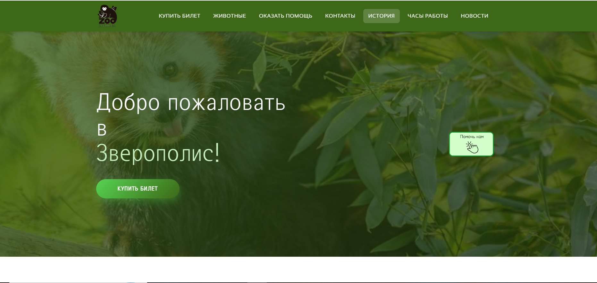

# ZOO — Зверополис

Многостраничный сайт зоопарка «Зверополис», свёрстанный с нуля на чистых HTML, CSS и JavaScript — без фреймворков, препроцессоров и конструкторов.

## Посмотреть сайт

https://angelina557744.github.io/zoo/

## 🛠 Стек технологий

- **HTML5** — семантическая разметка (`header`, `nav`, `main`, `section`, `article`, `figure`, `footer`), ARIA-атрибуты (`aria-required`, `aria-invalid`, `aria-describedby`, `role="alert"`, `aria-modal`)
- **CSS3** — Flexbox, CSS Grid, CSS-переменные, `clamp()`, `aspect-ratio`, `object-fit`, кастомные градиенты, стилизованный `<select>` через inline-SVG
- **JavaScript (Vanilla)** — без библиотек и фреймворков
- **Google Fonts** — подключение шрифтов
- **Карта** — через `iframe`

## 📄 Страницы проекта

- **Главная** — hero с параллаксом, секции с появлением при скролле, анимированные счётчики статистики
- **Животные** — фильтрация карточек по категориям, живой счётчик результатов, кнопка «Показать ещё», модальные окна с подробной информацией
- **Купить билет** — форма с маской телефона, счётчиками количества, автоподсчётом стоимости и валидацией
- **Оказать помощь** — блок донатов с выбором суммы, кастомным вводом, анимированным прогресс-баром и модалкой с QR-кодом
- **Контакты** — карточки контактов, кнопки копирования через Clipboard API, карта через iframe

## ✨ Что реализовано

- Фиксированная шапка с бургер-меню для мобильных
- Hero-секция с эффектом параллакса на JavaScript и поддержкой `prefers-reduced-motion`
- Появление секций при скролле через Intersection Observer
- Анимированные счётчики статистики
- Кнопка «Наверх» с автоскрытием
- Scrollspy для подсветки активного пункта меню
- Фильтрация карточек животных по категориям с живым счётчиком результатов и кнопкой «Показать ещё»
- Модальные окна с подробной информацией о животных: открытие по клику, закрытие по Esc, клику на фон и на крестик
- Форма покупки билетов с маской телефона, счётчиками количества, автоматическим подсчётом итоговой стоимости
- Валидация полей с выводом ошибок под каждым input и блокировкой даты в прошлом
- Блок донатов с выбором суммы, кастомным вводом, анимированным прогресс-баром и модальным окном с QR-кодом
- Кнопки копирования email и телефона через Clipboard API
- Контактная страница с картой через iframe
- Корректная обработка клавиатуры и ARIA-атрибуты для доступности

## 🏗 Архитектура стилей

- Единый `style.css` с CSS-переменными для цветов и переходов
- БЭМ-подобная методология именования классов
- Адаптив от 320 до 1920 пикселей через медиа-запросы
- Гибкие сетки на Flexbox и Grid
- Типографика на `clamp()`
- Изображения через `object-fit` и `aspect-ratio`
- Кастомный счётчик билетов
- Стилизованный `<select>` через inline-SVG
- Кастомный progress bar и градиентные фоны

## 📱 Адаптивность

Проект корректно отображается на всех разрешениях:

- Мобильные: 320–576 px
- Планшеты: 576–992 px
- Ноутбуки: 992–1200 px
- Десктоп: 1200–1920 px

## 🎯 Что демонстрирует проект

- Продвинутая адаптивная вёрстка без конструкторов
- Работа с нативным JavaScript без библиотек
- Доступность: ARIA-атрибуты, обработка клавиатуры, `prefers-reduced-motion`
- UX-микровзаимодействия: параллакс, анимации появления, счётчики, scrollspy, автоскрытие кнопки «Наверх»
- Интеграция сторонних виджетов (карта через iframe, QR-код)
- Построение расширяемой CSS-системы на переменных

## 📂 Структура проекта
